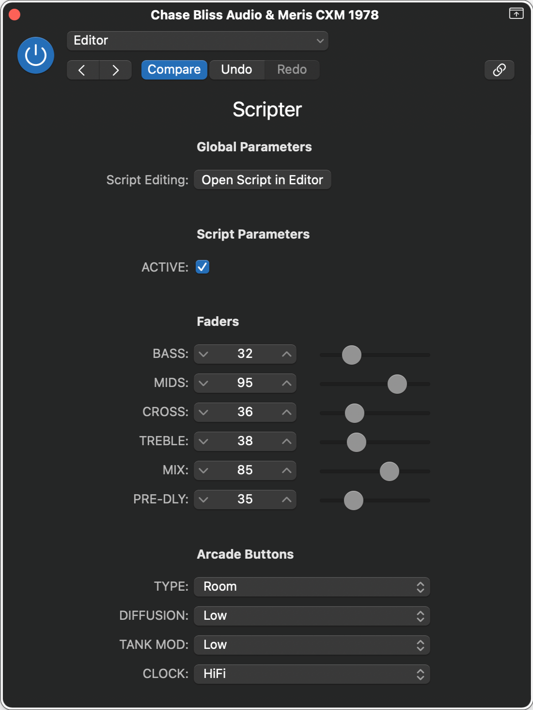

# Chase Bliss Audio & Meris CXM 1978

## Editor

||
|:--:|
|User Interface|

**Parameters**:

- ACTIVE
  - On/Off
- **Faders:**
  - BASS
  - MIDS
  - CROSS
  - TREBLE
  - MIX
  - PRE-DLY
- **Arcade Buttons:**
  - TYPE
    - Room
    - Plate
    - Hall
  - DIFFUSION
    - Low
    - Medium
    - High
  - TANK MOD
    - Low
    - Medium
    - High
  - CLOCK
    - HiFi
    - Standard
    - LoFi
