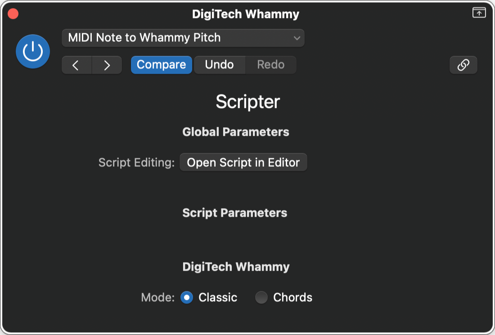

# DigiTech Whammy

## MIDI Note to Whammy Pitch

Converts MIDI note data to CC values for expression and Program Change data.

||
|:--:|
|User Interface|

**Parameters**:

- **DigiTech Whammy:**
  - Mode
    - Choose between classic mode and chord mode
