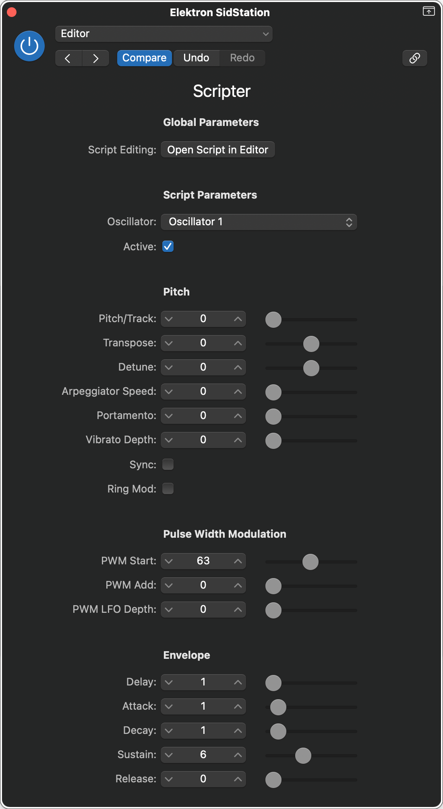
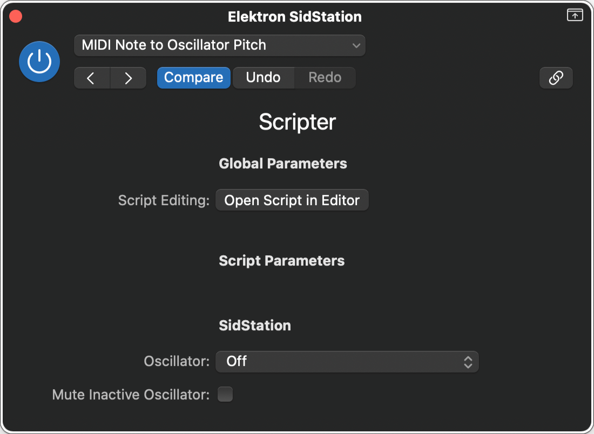

# Elektron SidStation

## Editor

||
|:--:|
|User Interface|

**Parameters:**

- Oscillator
- Active
- **Pitch:**
  - Pitch/Track
  - Transpose
  - Detune
  - Arpeggiator Speed
  - Portamento
  - Vibrato Depth
  - Sync
  - Ring Mod
- **Pulse Width Modulation:**
  - PWM Start
  - PWM Add
  - PWM LFO Depth
- **Envelope:**
  - Delay
  - Attack
  - Decay
  - Sustain
  - Release

## MIDI Note to Oscillator Pitch

||
|:--:|
|User Interface|

**Parameters:**

- **SidStation:**
  - Oscillator
  - Mute Inactive Oscillator
